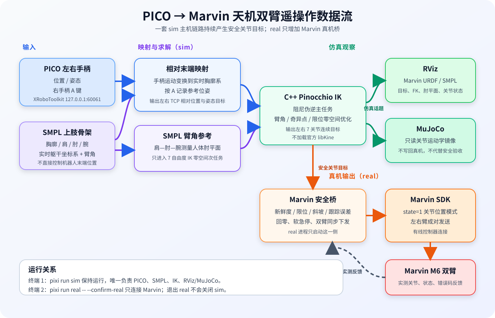

# PICO → Marvin 天机双臂遥操作（Pixi 单文件便携包）

本包适用于 Ubuntu 22.04 x86_64，可在同一台电脑上完成：

- PICO 左右手柄和 SMPL 上肢数据读取；
- 可切换的 C++ 双臂 IK（Pinocchio / 天机官方 `libKine`）；
- MuJoCo 纯运动学仿真；
- Marvin SDK 真机关节位置遥操作；
- 真机状态监控和安全停机。

运行时不需要 Docker、不要求预装任何机器人中间件，也不需要现场编译。本包包含
Wuji Hand 2（wuji2）手部资产与**固定版本的 wuji-sdk C 库**
（`vendor/wuji-sdk`，v2026.8.17，随包校验）；机器人侧只保留 PICO
输入、天机坐标转换与 wuji2 手部控制所需的最小模块。



正确运行关系是终端 1 持续运行一套 `sim`，终端 2 只运行一套
`real`。`real` 复用 `sim` 的 PICO、SMPL 和 IK 输出，不会再
启动第二套输入或 IK 节点。

## 是否可以独立控制天机

可以。本仓库已经携带运行所需的 Zenoh（`vendor/zenoh` 的 zenoh-c 库与
`eclipse-zenoh` pip 绑定）、Pinocchio、MuJoCo、PICO Python/原生 SDK、
Marvin Python SDK 和本项目节点。在支持的电脑上克隆后，不依赖 Docker、
系统预装机器人中间件、官方 Wuji 仓库、FxStation 或官方 `libKine`
即可启动完整链路：

```text
PICO + SMPL → 可配置 IK → 真机安全桥 → Marvin SDK → 天机双臂
```

这里的“独立”不代表不需要外部设备和服务。运行时仍然需要：

- Ubuntu 22.04 x86_64 电脑和 Pixi；
- 本机正在运行的 PXREA Unity/XRoboToolkit 数据服务；
- 已唤醒并持续发送手柄、A 键和 SMPL 数据的 PICO；
- 与电脑有线直连、已上电并释放实体急停的 Marvin 控制器。

`pixi run sim` 独立产生 PICO/SMPL/IK 目标；`pixi run real` 只连接
Marvin 并复用该目标。因此二者属于同一个独立项目，但真机运行时必须
保持一套 `sim` 与一套 `real` 同时运行。

默认使用 `pinocchio_cpp`。工程已提供稳定的 `ArmIkSolver` 接口、速度级
`pinocchio_qp` 和 `tianji_official` 运行时适配器，可通过 YAML 切换且无需
改动数据链路 key 和真机安全桥。各后端配置和离线验证方法见
[IK 后端接口与切换](docs/ik_backends.md)。

## 运行前提

- Ubuntu 22.04 x86_64；
- 可以访问软件源的网络，用于首次安装 Pixi 环境；
- PXREA Unity/XRoboToolkit 服务和 PICO 在同一台电脑可用；
- 真机测试时，电脑有线网卡与 Marvin 控制器位于同一网段。

先检查 Pixi：

```bash
pixi --version
```

如果命令不存在，可按
[Pixi 官方安装说明](https://pixi.sh/latest/installation/)安装：

```bash
curl -fsSL https://pixi.sh/install.sh | sh
source ~/.bashrc
pixi --version
```

## 快速开始：Motive 动捕真机运行

环境就绪且 Windows 侧 Motive 动捕发布已运行（`windows_pub.sh`）时，
两个终端即可驱动真机：

```bash
# 终端 1：Motive 定零 + 键盘步进/正面圆轨迹（主机链路，含 IK）
pixi run sim_mocap_live

# 终端 2：真机桥（确认机械臂安全、急停释放后执行）
pixi run real_mocap_live -- --confirm-real
```

- 终端 1 先等日志出现 `刚体名映射已更新：{..., 3: 'tianji_wrist'}` 和
  `Motive right frame=... tracking=ok`（动捕数据已到）；
- 终端 2 等 `真机链路已就绪：保持安全零位，主机开始遥操作后跟随`，
  再回到终端 1 操作；

| 按键 | 作用 |
| --- | --- |
| `s` | 冻结 `tianji_wrist` 当前位姿为零点，开始控制 |
| `↑/↓/←/→/1/0` | 连续累计步进（每键 10mm，动捕系），可无限次 |
| `c` | 零位装载右臂正面圆轨迹；此时不会自行运动 |
| 按住 `Enter` | 推进圆轨迹；松开后一个 60Hz 控制周期内暂停，再按继续 |
| `s` | 请求回 Home；回零完成后程序不退出，可再次按 `s` 开始新一轮 |
| `q` / Ctrl+C | 回 Home 完成后安全退出 |

`real_mocap_live` 只复用 `sim_mocap_live` 的 IK 关节命令，不会启动
第二套输入或 IK；跟踪误差、命令超时、限速斜坡与急停检测等安全保护
全部在真机桥侧生效。完整说明见后文
「Motive 刚体定零 + 键盘步进/正面圆轨迹（sim_mocap_live / real_mocap_live）」。

## 第一次使用：推荐顺序

### 1. 获取简化版项目并进入目录

源码开发可从 GitHub 克隆：

```bash
git clone git@github.com:suzhelearning/tianji_teleop.git
cd tianji_teleop
```

Git 仓库只跟踪源码、脚本、配置和 Pixi 锁文件，不跟踪 `.pixi/`、
`runtime/`、`vendor/`、`build/`、`log/`、`staging/` 等本地环境或
生成物。因此源码克隆不能直接运行 `doctor`、仿真或真机任务。

运行仿真或真机时应使用独立压缩包，其中包含经过校验的运行时和厂商
二进制。只需要复制这一份压缩包到目标电脑，不需要同时复制源码仓库、
Docker 镜像、构建工作区或外置校验文件。执行：

```bash
tar -xzf pico_tianji_teleop_standalone_*.tar.gz
cd pico-tianji-real-teleop
```

后续命令都在 `pico-tianji-real-teleop` 目录中执行。运行
`pixi run doctor` 时会使用包内的 `VENDOR_SHA256SUMS` 和
`RUNTIME_TREE_SHA256` 自动检查厂商文件及运行时树，不依赖压缩包旁边
的第二个文件。

### 2. 安装锁定环境并做离线检查

```bash
pixi install --locked
pixi run doctor
pixi run test
```

- `pixi install --locked`：安装包内锁定的 Python、NumPy、SciPy、
  MuJoCo 和 eclipse-zenoh 版本；
- `pixi run doctor`：检查 Zenoh（vendored C 库、Python 绑定与本地
  会话）、Pinocchio、MuJoCo、URDF、mesh 和厂商 SDK 文件；
- `pixi run test`：短暂启动纯运动学节点并检查 Zenoh 数据链路。

这三个步骤不会连接或驱动实体机械臂。`doctor` 会离线加载 Marvin SDK
检查文件与 ABI，但不会建立控制器连接。

普通使用者不需要在系统中安装任何机器人中间件。通讯使用内置 Zenoh：
`vendor/zenoh` 提供 zenoh-c C 库与头文件，`eclipse-zenoh` pip 包提供
Python 绑定（由 Pixi 锁定）；前提是拿到完整项目，不能只复制 `src`、
`pixi.toml` 和 `pixi.lock`。完整项目至少应保留
`runtime/pico_body_tianji`、`runtime/pin`、`runtime/abi`、`vendor/python`
和 `vendor/zenoh`。

`pixi install --locked` 一次只安装 `default` 环境，不会安装或检查
`ik-build`。直接运行 `pixi run sim` 也会自动安装缺失的默认环境，但首次
使用仍建议显式执行上面的安装和检查命令。两套 Pixi 环境的用途如下：

| Pixi 环境 | 安装命令 | 是否要求系统机器人中间件 |
| --- | --- | --- |
| 普通运行 `default` | `pixi install --locked` | 否，使用内置 Zenoh |
| 重新编译 `ik-build` | `pixi install --locked -e ik-build` | 安装本身不要求；执行 `build-ik` 时要求 `vendor/zenoh`（zenoh-c standalone）与 `vendor/zenoh-cpp` 已就位 |

普通使用者不要执行 `pixi install --all`，也不需要执行 `build-ik`。只有修改
C++ IK 源码并准备重新编译的开发者，才需要下一节。

### 3. 可选：替换 IK、重新编译并运行

本节是 IK 开发流程，普通使用者可以直接跳到“准备 PICO 输入”。所有 IK
切换、编译、部署和启动命令集中放在这里。不要直接修改 `runtime` 下的
YAML 或二进制：`runtime` 是实际运行目录，其 IK 内容由 `src` 编译并通过
`deploy-ik` 部署。

重新编译要求 Ubuntu 22.04 x86_64，并准备：

- 系统 GCC/G++ 11–13（Ubuntu 22.04 为 GCC 11，Ubuntu 24.04 为 GCC 13），
  CMake 由 pixi ik-build 环境提供；
- 仓库根 `vendor/zenoh` 下的 zenoh-c 1.10.0 standalone 库与头文件，
  以及 `vendor/zenoh-cpp` 的 zenoh-cpp 头文件（vendored，不入 git）；
- `urdfdom_headers` 等构建依赖由 ik-build 环境提供。

Pixi 负责锁定 Python、Pinocchio（pin）和 eclipse-zenoh 绑定；构建不
依赖任何系统机器人中间件。没有准备 `vendor/zenoh` 时普通运行不受
影响，但执行 `build-ik` 会明确报告缺少 `vendor/zenoh/lib/libzenohc.so`。

运行模式的公共配置如下：

| 运行模式 | 修改的配置文件 | Sim 命令 | Real 命令 |
| --- | --- | --- | --- |
| PICO + SMPL 全身链路 | `src/pico_body_tianji/config/mode/full_body/preview.yaml` | `pixi run sim` | `pixi run real` |
| 纯手柄链路 | `src/pico_body_tianji/config/mode/controller_only/controller_only_ik.yaml` | `pixi run sim_controller_only` | `pixi run real_controller_only` |
| mocap 键盘步进 | `src/pico_body_tianji/config/mode/controller_only/controller_only_ik.yaml` | `pixi run sim_mocap_step` | `pixi run real_mocap_step -- --confirm-real` |
| mocap 实时定零步进 | 同上 | `pixi run sim_mocap_live` | `pixi run real_mocap_live -- --confirm-real` |
| mocap HDF5 右腕回放 | 同上 | `pixi run sim_mocap_h5 -- TAKE.h5` | `pixi run real_mocap_h5 -- --confirm-real` |

配置先按运行模式分组；每种模式各有一个 Sim/IK 配置和一个 Real 配置：

```text
src/pico_body_tianji/config/mode/
├── full_body/
│   ├── preview.yaml
│   └── real.yaml
└── controller_only/
    ├── controller_only_ik.yaml
    └── controller_only_real.yaml
```

`preview.yaml` 和 `controller_only_ik.yaml` 已包含三种 IK 的全部参数。
程序只使用当前后端需要的部分。IK 不在命令行选择，只需在对应模式的
YAML 中修改一行：

```yaml
tianji_kinematic_sim:
  ik_backend: pinocchio_qp  # 或 pinocchio_cpp / tianji_official
```

启动脚本通过 `--config <yaml>` 加载配置文件（C++ IK 节点直接接收
`key:=value` 参数，Python 节点接受 `--param key:=value` 覆盖），参数名
与 YAML 键一致；旧式 `ros__parameters` 嵌套结构仍可读取，新写法为节点
段内直接平铺参数。

运行模式和 IK 后端正交：命令选择输入/输出链路，YAML 中的
`ik_backend` 选择求解器。不要把模式名与 IK 名组合成新命令。

官方库路径和机型配置保持空字符串即可，运行时包装器会使用项目内的
`runtime/tianji_official`。修改完成后，在项目根目录依次执行：

```bash
# 首次配置 ik-build 或 pixi.lock 更新后执行
pixi install --locked -e ik-build

# 编译 src 下的 C++ IK，产物先进入 staging/ik
pixi run -e ik-build build-ik

# 检查 QP 左右臂收敛、不可达恢复和求解耗时
staging/ik/lib/pico_body_tianji/pinocchio_qp_ik_probe \
  src/pico_body_tianji/assets/marvin_m6_ccs/urdf/marvin_m6_s_ccs_696_v4.urdf

# 把新二进制、官方 SDK 和完整 config 目录部署到 runtime
pixi run -e ik-build deploy-ik

# 检查部署后的运行环境和 Zenoh 数据链路
pixi run doctor
pixi run test
```

如果只修改了 YAML，且 `staging/ik` 中已有上一次的完整编译产物，可以
跳过 `build-ik`，只执行 `pixi run -e ik-build deploy-ik`。该命令
会递归同步整个 `src/pico_body_tianji/config/` 到 runtime，包括两种模式的
四个 YAML。部署时还会移除 runtime ELF 的 DWARF
调试信息，完整 `RelWithDebInfo` 产物继续保留在 `staging/ik`，
避免将调试符号作为大文件提交到 Git。修改了
`src/pico_body_tianji/src/`、头文件或 `CMakeLists.txt` 时，必须重新执行
`build-ik` 和 `deploy-ik`。

全身模式编译部署完成后，终端 1 和终端 2 分别执行：

```bash
# 终端 1
pixi run sim

# 终端 2：确认仿真正常后再执行
pixi run real -- \
  --confirm-real \
  --velocity-ratio 20 \
  --acceleration-ratio 20
```

纯手柄模式使用：

```bash
# 终端 1
pixi run sim_controller_only

# 终端 2：确认仿真正常后再执行
pixi run real_controller_only -- \
  --confirm-real \
  --velocity-ratio 20 \
  --acceleration-ratio 20
```

低速验收完成后，常规跟随 profile 可直接使用脚本默认的 65% 速度、85%
加速度；纯手柄 IK 限制为 75.6°/s，真机桥限制为 80°/s：

```bash
pixi run real_controller_only -- --confirm-real
```

验证 QP 时，在对应的公共 YAML 中把 `ik_backend` 改为
`pinocchio_qp`，部署后仍使用上面的同一条 Sim 命令。QP profile 是基于
90 Hz、现有 0.68° 公共单步契约和离线轨迹得到的保守初值；连接真机前
仍必须完成手柄 replay、低速和小工作空间验证。

Real 不会再启动一套 IK，只复用对应 Sim 发布的 14 关节目标。真机前必须
确认只有一套 Sim 在运行、FxStation 已关闭、实体急停已释放，并等待 Real
显示 `phase=armed_idle` 后再单击右手柄 A。结束时先在 Real 终端按
`Ctrl+C`，看到 `Robot released` 后再关闭 Sim。

### 4. 准备 PICO 输入

1. 在同一台电脑启动 PXREA Unity/XRoboToolkit 服务；
2. 戴上并唤醒 PICO；
3. 确认左右手柄、右手柄 A 键和 SMPL Body 持续发送；
4. 保持双手在舒适位置，暂时不要按 A。

XRoboToolkit 默认由本机 `127.0.0.1:60061` 提供数据。若日志一直停在
`Waiting for device discovery`，先处理 PICO/XRoboToolkit 连接，不要
启动真机。

下一步运行 `pixi run sim` 后，输入正常时，启动终端会出现设备发现/
连接信息，MuJoCo 预览中的机械臂会随人体和手柄运动。若机械臂保持
不动，即使服务进程仍在，也不能视为数据正在持续刷新。

如果要先确认“不佩戴腿部 Motion Tracker 时，左右手柄是否仍能到达
MiniPC”，关闭正在运行的 `sim`/`real`，关闭两枚 Motion Tracker，保持
PICO、左右手柄和 XRoboToolkit 服务在线，然后执行：

```bash
pixi run pico-probe -- --duration 15
```

检测过程中分别移动左右手柄。该命令只读取 SDK，不启动 IK、不发布控制目标，也不连接 Marvin。最终出现
`controller_link_live: true` 表示双手柄有效位姿和递增时间戳持续到达；
`body_data_received: false`、`motion_tracker_count: 0` 是关闭腿部 Tracker
后的预期结果，不会导致检测失败。

### 5. 运行纯手柄到 IK 输出

确认 `pico-probe` 通过后，继续保持 XRoboToolkit 的 Controller 和 Send
开启，关闭 Body Tracking。确认没有运行 `sim`、`real` 或其他 SDK
客户端，在终端 1 执行：

```bash
pixi run sim_controller_only -- --topics-only
```

该命令只启动 `pico_controller_only_input` 和
`tianji_kinematic_sim`，不启动 MuJoCo 预览，也不连接 Marvin。
看到安全初始位就绪后，松开再单击右手柄 A，然后小幅移动左右手柄。

在终端 2 查看 IK 输出的左右臂 14 个关节角（弧度）：

```bash
pixi run controller-only-joints
```

主要输出话题为：

```text
/pico_body_sim/left_arm/joint_commands   # 左臂 7 关节，单位为度
/pico_body_sim/right_arm/joint_commands  # 右臂 7 关节，单位为度
/pico_body_sim/model_joint_states        # 双臂 14 关节，单位为弧度
```

名称沿用原话题名；Zenoh key 表达式去掉前导斜杠（如
`pico_body_sim/left_arm/joint_commands`）。位姿/关节状态类消息为 JSON
（UTF-8），字符串/布尔类消息为裸文本。

要同时查看 MuJoCo 预览，先关闭上述无界面任务，再执行：

```bash
pixi run sim_controller_only
```

松开再单击右手柄 A 后，小幅移动左右手柄即可观察对应机械臂。


### 7. 启动真机

保持已经验收的仿真任务运行：普通模式使用 `pixi run sim`，纯手柄模式
使用 `pixi run sim_controller_only`。真机任务只启动 Marvin 安全桥，
复用对应的主机侧 PICO + IK 链路，不会再启动第二套 PICO/IK。
同时确认没有其他旧版 PICO 天机任务、官方控制节点、FxStation 或
Marvin SDK 会话在运行。

仿真主机链路和真机桥分别持有跨解压目录运行锁，因此可以同时运行，
但各自不能重复启动。正常退出、`Ctrl+C` 或子节点异常退出时，脚本只
停止自己管理的进程；如果主脚本曾被强制杀死，同类任务下次启动会根据
受管 PID 和进程启动时间自动清理遗留进程。真机桥启动前还会通过
Zenoh liveliness（`tj/live/*`）确认恰好只有一个 PICO 输入节点和一个
IK 节点。外部旧节点不会被冒险误杀，而会触发拒绝启动。

#### 7.1 配置天机有线网口

调试网线连接控制器 ETH1 或 ETH3。官方调试网段使用：

| 设备 | IPv4 地址 |
|---|---|
| 电脑有线网卡 | `192.168.1.165/24` |
| Marvin 控制器 | `192.168.1.190` |

Wi‑Fi 可以继续用于互联网，但机器人有线连接不要配置默认网关。先查找
有线网卡名：

```bash
nmcli device status
ip -brief link
```

以下假设网卡是 `enp3s0`，必须按本机输出修改：

```bash
WIRED_IF="enp3s0"

nmcli connection show tianji-static >/dev/null 2>&1 || \
  sudo nmcli connection add \
    type ethernet \
    con-name tianji-static \
    ifname "$WIRED_IF"

sudo nmcli connection modify tianji-static \
  connection.interface-name "$WIRED_IF" \
  ipv4.method manual \
  ipv4.addresses 192.168.1.165/24 \
  ipv4.gateway "" \
  ipv4.dns "" \
  ipv4.never-default yes \
  ipv6.method disabled

sudo nmcli connection up tianji-static
```

验证地址和路由：

```bash
WIRED_IF="enp3s0"
ip -4 -brief address show dev "$WIRED_IF"
ip route get 192.168.1.190
ping -c 3 192.168.1.190
```

`ip route get` 必须显示从所选有线网卡发出，并包含
`src 192.168.1.165`。如果控制器禁止 ICMP，ping 失败不一定表示 SDK
不可连接；应先用 FxStation 验证连接，随后**完全关闭 FxStation**再
启动本项目。若路由走 Wi‑Fi 或其他网卡，不要启动真机。

需要恢复普通 DHCP 时：

```bash
sudo nmcli connection modify tianji-static \
  ipv4.method auto \
  ipv4.addresses "" \
  ipv4.never-default no \
  ipv6.method auto
sudo nmcli connection up tianji-static
```

#### 7.2 启动真机桥

首次在新电脑联调，推荐从较低控制器比例开始：

```bash
pixi run real -- \
  --confirm-real \
  --velocity-ratio 20 \
  --acceleration-ratio 20
```

确认空载低速运行正常后，可使用当前默认值：

```bash
pixi run real -- --confirm-real
```

默认控制器速度为 50%，加速度为 70%。也可明确指定控制器地址：

```bash
ROBOT_IP="192.168.1.190"  # 如控制器地址不同，请修改这里
pixi run real -- \
  --confirm-real \
  --robot-ip "$ROBOT_IP" \
  --velocity-ratio 50 \
  --acceleration-ratio 70
```

启动后程序会自动执行：

```text
连接 Marvin
  → 检查并尝试清除已经释放的历史错误
  → 检查控制器、双臂和 14 个伺服轴
  → 读取当前实测关节角
  → 以实测角无跳变进入 state=1 关节位置模式
  → 以不高于 10°/s 缓慢到达安全零位
  → 等待主机状态和反馈稳定
  → 进入 phase=armed_idle
```

因此，执行真机命令后、按 A 之前，机械臂也会自动缓慢移动到安全零位。
必须提前清空双臂运动空间并握住实体急停。

只有看到以下日志后才能按右手柄 A：

```text
真机链路已就绪：保持安全零位，按右手柄 A 开始。
```

或者在状态中确认：

```text
phase=armed_idle
```

此时单击右手柄 A 开始遥操作；再次单击 A，或 PICO/SMPL 数据中断，
机械臂会缓慢回安全位。真机终端按 `Ctrl+C` 会安全停止并释放 Marvin
SDK 会话，但不会关闭仿真。结束全部工作时，先关闭真机终端并等待
`Robot released`，再到仿真终端按 `Ctrl+C`。

#### 7.3 启动纯手柄真机桥（不使用 Body/Tracker）

终端 1 保持纯手柄仿真运行：

```bash
pixi run sim_controller_only
```

此时不要按 A，先确认仿真双臂已经处于安全初始位。终端 2 首次联调建议
以较低比例启动纯手柄真机桥：

```bash
pixi run real_controller_only -- \
  --confirm-real \
  --velocity-ratio 20 \
  --acceleration-ratio 20
```

它复用终端 1 的纯手柄输入、IK 和 14 关节命令；不会启动第二
套输入或 IK，也不要求 SMPL Body 和腿部 Motion Tracker。原有的回零、
命令新鲜度与同步、反馈、关节硬限位、输出斜坡、跟踪误差和安全停机检查
保持不变。

只有看到下面的日志，或状态显示 `phase=armed_idle` 后才能按 A：

```text
真机链路已就绪：保持安全零位，按右手柄 A 开始。
```

此后右手柄 A 同时控制仿真显示和真机；再次按 A 或手柄数据中断时，真机
缓慢回安全位。结束时先在终端 2 按 `Ctrl+C` 并等待 `Robot released`，
再关闭终端 1 的仿真。

### 8. 另开终端监控真机状态

进入同一解压目录后执行：

```bash
pixi run status
```

重点查看：

- `phase`：当前真机阶段，正常待机应为 `armed_idle`；
- `robot_connected`：是否已连接控制器；
- `error_codes`：左右臂控制器错误码；
- `servo_error_reports`：左右臂 14 个伺服轴错误明细；
- `tracking_error_detail`：发生跟踪误差时的机械臂、关节和角度；
- `error`：启动失败或安全停机的直接软件判据；
- `readiness`：主机链路尚未就绪时的原因。

复现纯手柄真机跟随迟滞、左右臂不同步或空间边界问题时，另开终端执行：

```bash
pixi run controller-only-real-diagnostic -- --duration 60
```

在 60 秒内完成单臂、双臂同时运动和问题位置复现。诊断器只订阅 Zenoh
key，不发布控制命令；结束后会打印输入速度/加速度、椭球工作空间、IK
单步、奇异/回退、软关节限位、真机输出斜坡、90 Hz 漏期和逐轴跟踪误差，
并将原始 JSONL 保存到 `diagnostics/`。传入 `--duration 0` 可一直采集到
`Ctrl+C`。

## 运行入口

| 命令 | 作用 | 是否连接真机 |
|---|---|---|
| `pixi run sim` | 同时启动仿真链路与 MuJoCo 预览 | 否 |
| `pixi run real -- --confirm-real` | 复用正在运行的 sim，启动真机桥 | **是** |
| `pixi run sim_controller_only` | 纯手柄 IK 的 MuJoCo 仿真 | 否 |
| `pixi run sim_mocap_step` | mocap 键盘步进控制（动捕系 10mm/键，s 启停） | 否 |
| `pixi run sim_mocap_live` | Motive `tianji_wrist` 定零 + 连续键盘位置步进（默认右臂 10mm/键） | 否 |
| `pixi run sim_mocap_h5 -- TAKE.h5` | 选择一个 mocap HDF5，回放 Manus 右腕轨迹（Enter 保压） | 否 |
| `pixi run real_mocap_step -- --confirm-real` | 复用键盘步进仿真，启动真机桥 | **是** |
| `pixi run real_mocap_live -- --confirm-real` | 复用 Motive 定零键盘步进仿真，启动真机桥 | **是** |
| `pixi run real_mocap_h5 -- --confirm-real` | 复用低速 H5 + IK 主机，启动真机安全桥 | **是** |
| `pixi run real_controller_only -- --confirm-real` | 复用纯手柄仿真，启动真机桥 | **是** |
| `pixi run wuji_hand2_dry` | wuji2 手桥 dry-run：键点→retarget→发布命令（不连接手） | 否 |
| `pixi run wuji_hand2_real -- --confirm-real` | 键点→retarget→Wuji Hand 2 关节控制 | **是** |

`doctor`、`test`、`pico-probe`、`status`、`controller-only-joints` 和
`controller-only-real-diagnostic` 是检查/观测工具，不是新的运行模式。
需要关闭 MuJoCo 时，支持该选项的仿真入口可追加
`-- --topics-only`；默认是 `--mujoco-only`。

## mocap 键盘步进控制（sim_mocap_step）

不用 PICO、不回放 h5：键盘在**动捕坐标系**（Motive，z-up）里给
机器人末端目标增量，每次按键 10mm（`--step-mm` 可调），目标经
Zenoh 发布（`/pico_body/{left,right}_arm_target_pose`）送入可配置
IK，按键后 0.5s 持续映射让滤波/整形收敛到完整步长。

| 按键 | 动捕系方向 | 按键 | 动捕系方向 |
| --- | --- | --- | --- |
| 上 ↑ | +z | 下 ↓ | -z |
| 左 ← | +x | 右 → | -x |
| `1` | +y | `0` | -y |
| `s` | 开始（armed 时） | `s` | 结束回 Home（步进中） |
| `q` / Ctrl+C | 退出（步进中先回 Home 再退出） | | |

**默认只控制右臂**（左臂目标不发布，IK 对无目标的臂保持当前关节角）；
`--side both` 恢复双臂同步。可作真机桥主机输入（身份
`mocap_keyboard_step` 不在真机桥冲突名单内）。

```bash
pixi run sim_mocap_step                     # MuJoCo 预览 + 键盘步进
pixi run sim_mocap_step -- --topics-only    # 无界面，仅右臂
pixi run sim_mocap_step -- --side both      # 双臂同步
pixi run sim_mocap_step -- --step-mm 5      # 每次 5mm
```

方向键在 raw 模式是 `\x1b[A/B/C/D` 转义序列，由 `ArrowKeyParser`
解析；步进节点前台运行，stdin 直连终端（raw 模式读键），不经过
launch/FIFO 转发。

**按键驱动真机**（逐点验收/标定）：先运行键盘步进仿真主机，再起
真机桥（安全桥 → Marvin 低层关节控制）：

```bash
# 终端 1：键盘步进 + IK 主机链路
pixi run sim_mocap_step

# 终端 2：真机桥（确认硬件安全后）
pixi run real_mocap_step -- --confirm-real
```

真机桥复用 IK 解算的关节命令（与 PICO 手柄链路同协议），
`host_readiness` 显式接受 `mocap_keyboard_step` 身份；桥只在双臂
命令就绪且位于 Home 时进入 armed_idle，随后按 `s` 开始、方向键
步进（默认仅右臂 10mm/键）、再按 `s` 回 Home、`q` 退出。

## 可选 HDF5 右腕轨迹回放（sim_mocap_h5 / real_mocap_h5）

每次运行通过位置参数选择一个 `mocap-acquisition` v4.0 HDF5。输入端
是 Manus wrist；机器人端直接对应 wuji hand2 beta1 厂商 URDF 的
**`r_wrist`**。按 `s` 时 raw `tianji_wrist` 经 GL/GO 到
`marker_mocap`，再经机械安装链定位 `r_mount` 和 `r_wrist` Home；
H5 Manus wrist 通过固定轴映射直接转换到 `r_wrist`。随后
`r_wrist→Tianji TCP` 固定外参送入 IK。节点只发布右臂目标，左臂
保持 Home。

```bash
# 选择本次要执行的轨迹
pixi run sim_mocap_h5 -- /path/to/take.h5

# 显示 frame0 的 21 个手关键点和 20 条骨段；自动使用 wuji2 组合 URDF
pixi run sim_mocap_h5 -- /path/to/take.h5 --frame0-skeleton

# 换另一个文件；无需修改配置或源码
pixi run sim_mocap_h5 -- /path/to/another_take.h5

# 只校验文件结构、有效帧和时长；不启动 IK，不运动
pixi run sim_mocap_h5 -- /path/to/take.h5 --validate-only

# 可选：无 MuJoCo、回放倍速、Motive +Z 朝向修正
pixi run sim_mocap_h5 -- /path/to/take.h5 --topics-only
pixi run sim_mocap_h5 -- /path/to/take.h5 --speed 0.5 --yaw-deg 10

# 刚体名称不是 tianji_wrist 时可显式指定名称或数字 id
pixi run sim_mocap_h5 -- /path/to/take.h5 --right-rigid-id tianji_tcp
```

`--frame0-skeleton` 读取 `hands/right/keypoints_world`（MediaPipe 21
点顺序），在 MuJoCo 里显示球形关键点与连线：白色腕点、黄色拇指、
绿色食指、蓝色中指、紫色无名指、橙色小指。节点在 Home 且 marker
有效时、按 `s` 前持续预览“此刻按 s”会到达的 frame0 目标；按 `s`
采样实时 marker 后冻结骨架。随后按住 `Enter`，即可把实际 wuji2 手
移动到固定骨架处，直接检查指尖、手心和每根手指的方向是否一致。
骨架不经过 `right_chest` 重建，也不使用 marker/wrist 局部姿态定义
世界轴。旋转固定为
`R_sim_from_motive = R_sim_from_robot_world * mocap_to_robot`；
`tianji_wrist → marker → r_mount → r_wrist` 计算 Motive Home 原点
位置，再用 `t_sim_from_motive = p_sim_wrist_home -
R_sim_from_motive * p_motive_wrist_home` 求平移。关键点只应用这一组
固定世界轴 + Home 原点变换，因此骨段长度和 H5 绝对姿态保持不变。

### 机械臂 Home 场景纯 H5 数据回放（sim_mocap_h5_replay）

机械臂加载 wuji2 组合 URDF 并保持配置 Home 关节角，不启动 IK、不
发布控制目标。运行时只订阅一次 Motive `tianji_wrist` 定位动捕原点；
世界旋转始终使用固定 `mocap_to_robot`，然后播放 H5 右手 21 点轨迹：

```bash
pixi run sim_mocap_h5_replay -- /path/to/take.h5 --loop
```

`Space` 暂停/继续，`R` 从首帧重播。无实时 Motive 时可传固定标定：

```bash
pixi run sim_mocap_h5_replay -- /path/to/take.h5 \
  --right-arm-pose=x,y,z,qx,qy,qz,qw
```


首次真机测试必须先在仿真中完整确认轨迹、方向和工作空间，再用两个
终端启动。以下示例中的刚体 ID 必须与 `mocap/hands/frame` 实际一致：

```bash
# 终端 1：低速 H5 + IK 主机；启动后先不要按 s / Enter
pixi run sim_mocap_h5 -- \
  /home/current/data/20260819/20260819_151737_102784_take003.h5 \
  --topics-only --speed 0.1 --yaw-deg 0 --right-rigid-id 3

# 终端 2：确认实体急停、48V、清场和刚体 ID 后启动真机桥
pixi run real_mocap_h5 -- --confirm-real
```

真机桥连接时先以受限速度把双臂送到安全 Home。等待终端 2 明确提示
“真机链路已就绪”（内部 `phase=armed_idle`）后，回终端 1 按 `s`：
节点读取本次随机摆放下的 raw tianji_wrist，应用 GL/GO 得到
marker_mocap，再经固定安装链推导 wuji2 `r_mount` 与 `r_wrist`
Motive 位姿。Enter 保压让机器人 `r_wrist` 接近 H5 Manus wrist
转换后的绝对 frame0；稳定到达后完全松开 Enter，按 `r` 装载后续
轨迹，再保压推进。入口只接受 `speed <= 0.25`、`yaw-deg = 0`、
IK 位于 Home、marker 新鲜有效。

操作顺序：

1. 启动终端 1，保持 Enter 松开；确认 H5 摘要与 marker 名称/ID 正确；
2. 保持 Enter 松开，按 `s`：读取 raw rigid，推导当前 `r_mount/r_wrist`；
3. **按住 `Enter`**，使机器人 `r_wrist` 接近 H5 wrist→r_wrist frame0；
4. 稳定后松开 Enter，按 `r` 装载后续轨迹；
5. 再按住 Enter 推进；活动阶段按 `s` 回 Home，`q` 回 Home 后退出。

位姿链：

```text
T_M_marker_home = T_M_tianji_wrist_raw · T_raw_marker_mocap
T_M_mount_home  = T_M_marker_home · T_marker_mount
T_M_wrist_home  = T_M_mount_home · T_mount_wrist
T_M_tcp_home    = T_M_wrist_home · inverse(T_tcp_wrist)
T_M_wrist_des(t)= T_M_h5_wrist(t) · T_manus_wrist
T_M_tcp_des(t)  = T_M_wrist_des(t) · inverse(T_tcp_wrist)
```

Motive 世界系与机器人世界系现在统一为 +X 前、+Y 左、+Z 上，
`mocap_to_robot` 为单位矩阵。raw `tianji_wrist` rigid 先应用 Motive
Visuals 外参：GL `[1,-4,2]mm`、GO Pitch/Yaw/Roll `[-1,10,0]deg`，
得到 URDF `marker_mocap` frame
（`T_world_marker=T_world_rigid·T_rigid_marker`）；rigid→marker
四元数为 `[-0.00869333,0.08715242,0.00076057,0.99615677]`。

`marker_mocap→r_mount` 为 `[0.004,0,0]m` / 
`[0,-0.70710678,0,0.70710678]`。厂商 beta1 固定关节
`r_mount→r_wrist` 为 `[0.003,0.00025016,-0.0285]m` /
`[0,0,0.0000081995,0.99999999997]`。TCP→r_mount 为
`[0,0,0.008]m` / `[0.70710678,0.70710678,0,0]`；所有 wrist 外参均
由这条物理链派生。

H5 的 wrist quaternion 是采集端已标定的 wrist 局部系 `W`；实际
frame0 21 点几何验证 `W +x` 指向指尖、`W +y` 指向手背、`W +z`
指向小指。采集端 `axis_transform` 只用于将 Manus 节点偏移表达进 W，
不能再次乘入 wrist pose。最终 `W→wuji2 r_wrist(B)` 为
`[[0,0,-1],[0,-1,0],[-1,0,0]]`（det=+1），四元数
`[0.70710678,0,-0.70710678,0]`。marker 局部外参与世界轴转换是
两件事，不得混用。
首次修改运行文件后需重新执行 `pixi run -e ik-build deploy-ik`。

**Motive 刚体定零 + 键盘步进/正面圆轨迹（sim_mocap_live / real_mocap_live）**：
订阅 `mocap/hands/frame`，默认读取贴在机器人右臂末端的 Motive
`right_arm` 刚体。按 `s` 时只冻结其当前位姿作为控制零点；之后不再
把刚体实测随动送入目标，避免“机器人运动 → 刚体运动 → 目标再次增加”
的正反馈。虚拟目标由键盘在冻结参考上累计位置，四元数保持不变：

| 按键 | 动捕系增量/动作 | 按键 | 动捕系增量/动作 |
| --- | --- | --- | --- |
| `↑` / `↓` | `+z` / `-z` | `←` / `→` | `+x` / `-x` |
| `1` / `0` | `+y` / `-y` | `s` | armed 时定零开始 / 控制中回 Home |
| `c` | 零位装载右臂正面圆 | `Enter` | 按住推进 / 松开暂停 / 再按继续 |

一次按 `s` 开始后，方向键/`1`/`0` 可无限次累计，每次都在当前键盘
目标上增加 10mm；节点不会自动停止。第二次按 `s` 才请求回 Home；
收到 IK 的 `return_complete=true` 且 `at_home=true` 后重新进入 armed，
进程不退出，可再次按 `s` 开始新一轮。只有 `q` / Ctrl+C 才最终退出。
回 Home 过程中按 `q` 会等待安全 Home 完成，不会立即断开。

保持键盘累计位移为零时按 `c` 只会**装载**轨迹，不会自行运动。
随后必须持续按住物理 `Enter`（主键盘 `Return` 或数字键盘
`KP_Enter`）；只有按住期间轨迹时钟才推进：

1. 按住 `Enter`：从冻结的 Motive 参考点沿 `+y` 上移 200mm；
2. 继续按住：以 `(x=0, y=+100mm)` 为圆心、100mm 为半径，在
   Motive `x-y` 平面从 `+z` 一侧看顺时针画圆；
3. 前半圈回到参考零点，不停顿地继续后半圈；
4. 整圈结束后保持在参考点上方 200mm，按 `s` 才回 Home。

任意时刻松开 `Enter`，轨迹在下一个 60Hz 控制周期内暂停并持续发布
当前位置；暂停时间不计入轨迹进度。再次按住会从同一位置继续，没有
重置或目标跳变，可以反复“按住→暂停→继续→暂停”。这不是依赖终端
按键自动重复的超时估计：节点通过 X11 `XQueryKeymap` 直接读取物理
按下/松开状态。若 `DISPLAY`/libX11 不可用，`c` 会明确拒绝启动，
不会降级成无法可靠识别松手的模式。

直线和圆相位使用 minimum-jerk 曲线，段首尾速度、加速度均为零；
默认峰值笛卡尔速度 50mm/s，需要累计按住约 31.1s（暂停会增加实际
用时）。轨迹只允许默认 `--side right`；若已手动步进偏离零点或使用
`--side both`，`c` 会明确拒绝，不会跳变到轨迹起点。参数位于
`controller_only_ik.yaml` 的 `mocap_live.circle_radius_mm` 和
`mocap_live.circle_maximum_speed_mm_s`。

```bash
pixi run sim_mocap_live                         # 默认仅右臂、10mm/键
pixi run sim_mocap_live -- --circle-speed-mm-s 30 # 圆峰值速度改为 30mm/s
pixi run sim_mocap_live -- --step-mm 5
pixi run sim_mocap_live -- --topics-only
pixi run sim_mocap_live -- --right-rigid-id right_arm

# 真机（先起上面的 sim 主机，再确认硬件安全后）
pixi run real_mocap_live -- --confirm-real
```

## Wuji Hand 2（wuji2）手部控制（wuji_hand2_dry / wuji_hand2_real）

加载组合 URDF 后（`sim_mocap_h5 -- --wuji2`），H5 回放节点同时发布
右手 Manus 键点（`pico_body_sim/right_hand/keypoints`，21×3 float32，
腕部相对，米）。`wuji_hand2_bridge`（C++，wuji-sdk C API）订阅键点，
经 session 内建 retarget 得到 20 关节角（firmware 序 == 组合 URDF
关节序），再以 MIT 阻抗命令驱动 Wuji Hand 2：

```bash
# 推荐：单终端完整 P0 回放（frame0 骨架 + IK + wuji retarget + 手指动画）
pixi run sim_mocap_h5 -- /path/to/take.h5 \
  --complete-wuji2-replay --speed 0.1 --yaw-deg 0 --right-rigid-id 3

# 等价的分进程调试模式：
# 终端 1：H5 主机
pixi run sim_mocap_h5 -- /path/to/take.h5 --wuji2 --frame0-skeleton
# 终端 2：仿真 retarget（不连接手）
pixi run wuji_hand2_dry -- --rate 100

# 真机：确认手部供电/网线/急停后
pixi run wuji_hand2_real -- --confirm-real
```

完整模式的 MuJoCo 窗口只显示两套 wrist 坐标轴，各自使用本地
X/Y/Z 的红/绿/蓝：

| 坐标轴 | 样式 | 含义 |
|---|---|---|
| Manus wrist W | 180mm、细、半透明浅 RGB | 固定在 H5 frame0，使用原始 `wrist_quaternion_xyzw` |
| 当前 FK Wuji r_wrist B | 115mm、粗、纯 RGB | 从机器人当前关节状态实时 FK，随机械臂移动 |

W 与 B 的轴定义不同：`W +X ↔ B -Z`、`W +Y ↔ B -Y`、
`W +Z ↔ B -X`，因此不要求同色轴同向。到达 frame0 时检查两个原点
重合，并按该跨颜色/反方向关系检查方向。转换后的目标 B 不再绘制第三套轴，
仅用于每 0.5s 的数值诊断：
`frame0 r_wrist 目标↔FK[IK target/solved]：位置误差=...mm 姿态误差=...°`。

键点来源是 H5 主机的 teleop 阶段（approaching/ready/replaying），
无键点帧时桥保持上一次命令（首帧零位）。mediapipe_rotation 默认取
wuji-retargeting 的 Manus 配置（右 z=-15°、左 z=+15°），可用
`--rotation-x/y/z` 覆盖；首次真机前建议 `wuji_hand2_dry` + `--log-qpos`
确认数值合理。桥发布：

| 话题 | 内容 |
|---|---|
| `pico_body_sim/{side}_hand/keypoints` | 主机 → 桥（63×float32 键点） |
| `pico_body_sim/{side}_hand/joint_commands` | 桥 → MuJoCo/诊断（20×float32 rad） |
| `pico_body_real/{side}_hand/joint_states` | 桥 → 回读（20×float32 rad） |
| `pico_body_real/{side}_hand/status` | JSON 状态（phase/enabled/joints_online/…） |

### 右手-only H5 回放（sim_mocap_h5_replay + --hand-only-replay）

不启动 IK、Tianji 双臂保持 Home 时,可直接回放 H5 驱动 Wuji2 右手。
`sim_mocap_h5_replay` 发布 Manus 右手键点并声明
`tj/live/wuji_hand_replay`;手部命令仍由
`wuji_hand2_{dry,real}` retarget 后发布到
`pico_body_sim/right_hand/joint_commands`,viewer 消费并动画。

```bash
# 终端 1:MuJoCo 窗口(暂停;Space 开始/暂停,末帧 Space 从头播放)
pixi run sim_mocap_h5_replay -- /path/to/take.h5 \
  --hand-commands --paused --speed 0.5

# 终端 2 预检(不连接、不使能硬件;只检查发布端)
pixi run wuji_hand2_real -- --readiness-only --hand-only-replay --side right

# 终端 2 仿真 retarget(不连接手)
pixi run wuji_hand2_dry -- --side right \
  --teleop-state-key pico_body_sim/right_hand/teleop_state

# 终端 2 真机(当前仅右手;跳过 IK 主机链检查,改用 wuji_hand_replay)
pixi run wuji_hand2_real -- --confirm-real --hand-only-replay --side right \
  --rate 100 --keypoint-timeout 0.5 --command-slew-rate 1.0 \
  --tracking-slew-rate 6.0 --teleop-grace-s 0.3 \
  --teleop-state-key pico_body_sim/right_hand/teleop_state
```

**状态门控隔离**:`sim_mocap_h5_replay` 把 teleop_state 发布到
`pico_body_sim/right_hand/teleop_state`(专属 key),而
`pico_body/teleop_state`(全局 key)同时被 PICO 输入链、H5 主机、
`controller_only_trace` 等广播 —— 桥若订全局 key 会收到多发布者
交替状态,出现"跟一下→回零→再跟"的周期卡顿。H5 回放链必须显式
传 `--teleop-state-key` 绑定专属 key。

**状态抖动与平滑**:`--teleop-grace-s`(默认 0.3s)定义离开 teleop
后的命令保持窗口:窗口内恢复 teleop 命令零扰动;超窗才以
`--command-slew-rate`(默认 1 rad/s)回零。`--tracking-slew-rate`
(默认 6 rad/s)只用于跟踪段的爬升上限,与回零速率解耦 —— 快速手部
动作不再被 1 rad/s 削成等速斜坡。桥日志 phase 区分
`tracking / hold / returning_zero / zero_hold`。
```

`--hand-only-replay` 只接受 `tj/live/wuji_hand_replay` 发布端,不接受
普通 IK 主机链;缺少发布端时 runner 拒绝连接。回放暂停或到末帧时,
桥保持 `returning_zero` 缓速回零,键点恢复后重新跟踪。

### 单 PC 真机控制网络（推荐）

采集系统 PC 同时运行 Motive/H5、IK、MuJoCo、Tianji 真机桥和 Wuji
真机桥。两个有线口职责固定：

```text
采集/控制 PC
├─ enp127s0：Motive/动捕网（保持当前配置）
└─ enp129s0：192.168.1.165/24，控制交换机，无 gateway
      ├─ Tianji          192.168.1.190
      ├─ Wuji2 Hand Left 192.168.1.110
      └─ Wuji2 Hand Right192.168.1.111
```

当前固化设备身份：

| 设备 | IP | 序列号 |
|---|---|---|
| Wuji2 Right | `192.168.1.111` | `WH2KA01260814006` |
| Wuji2 Left | `192.168.1.110` | 尚未固化，运行时必须显式 `--serial` |

右手 runner 在未传 `--serial/--address` 时自动使用
`WH2KA01260814006`；显式设备选择始终优先。

不再使用 Wuji2 专用 PC，不做 IP forwarding、NAT、Linux bridge 或跨 PC
Zenoh。控制交换机只承载厂商设备流量，Wi-Fi 继续承担默认路由/互联网。
持久化配置：

```bash
sudo nmcli con add type ethernet ifname enp129s0 con-name robot-control-lan \
  ipv4.method manual ipv4.addresses 192.168.1.165/24 \
  ipv4.never-default yes ipv6.method disabled
sudo nmcli con up robot-control-lan

ip -4 addr show dev enp129s0
ip route get 192.168.1.190
ip route get 192.168.1.110
ip route get 192.168.1.111
ping -I enp129s0 192.168.1.190
ping -I enp129s0 192.168.1.110
ping -I enp129s0 192.168.1.111
```

三台设备的路由结果都必须是 `dev enp129s0 src 192.168.1.165`，且该连接
不得产生 default route。Zenoh 控制话题全部在本机用默认 scouting；现有
Router 继续只负责 Motive/Manus 数据，无需放行远程 `pico_body/**`。

### Tianji + Wuji2 Hand 完整真机 H5 回放

完整真机必须使用外部手桥预览模式，**不要**使用
`--complete-wuji2-replay`（后者会启动 dry 桥，与真机桥双发布冲突）。

```bash
# 终端 1：Motive/H5/IK/MuJoCo 主机；viewer 手指命令来自外部真机手桥
pixi run sim_mocap_h5 -- /path/to/take.h5 \
  --complete-wuji2-real-preview --speed 0.1 --yaw-deg 0 \
  --right-rigid-id 3

# 终端 2：Tianji/Marvin 双臂真机桥（首次固定 10% 速度/加速度）
pixi run real_mocap_h5 -- --confirm-real

# 终端 3：Wuji2 Hand 真机桥
pixi run wuji_hand2_real -- --confirm-real \
  --side right --serial WH2KA01260814006 \
  --rate 100 --keypoint-timeout 0.5 --command-slew-rate 1.0 \
  --tracking-slew-rate 6.0 --teleop-grace-s 0.3
# 无 SN 时可用：--address 192.168.1.111:50001（端口以 SDK scan 为准）
```

启动顺序：先终端 1，确认 Motive ID/IK/Home；再终端 2 等
`phase=armed_idle`；最后终端 3。手桥在 `idle/unknown` 保持零位，只有
`teleop` 且键点新鲜时才跟踪。终端 1 操作 `s → Enter → r → Enter`；
按 `s` 回 Home 时手桥进入 `returning_zero`，按 1rad/s 缓速回零。
键点超过 0.5s 未更新同样自动回零。终端 3 status 包含
`teleop_state`、`tracking_allowed`、`keypoint_timed_out` 和
`command_max_abs_rad`。

安全退出：先在终端 1 按 `s`，确认机械臂 Home 且手桥
`phase=zero_hold`；再终端 3 Ctrl+C（disable 手），终端 2 Ctrl+C
看到 `Robot released`，最后终端 1 按 `q`。

### 正面圆轨迹录制与坐标对齐对比

录制器同时订阅三路数据（已废弃，代码已移除）：

按 `s` 定零时，所选刚体必须存在、`tracking_valid=true` 且最新帧不超过
0.5s；默认只要求 `tianji_wrist`。终端每 0.5s 显示所选 Motive 刚体的
`frame`、跟踪状态、帧龄、位置 `p[m]`、四元数 `q[xyzw]`、累计目标
位移 `key_delta[mm]` 和阶段；同一数据写入 status 的 `motive_pose`。
圆轨迹进度和保压状态写入 `circle_trajectory`，包括
`elapsed_hold_s`、`deadman_available`、`deadman_pressed` 和
`deadman_error`。
刚体后续随机器人运动只用于显示和跟踪健康检查，不反馈进目标。status
标识 `control_mode=motive_reference_keyboard_step`，真机桥拒绝旧的
连续刚体反馈模式。默认仅发布右臂目标；`--side both` 才要求左右刚体
同时有效。

## 控制原理

```text
PICO 左右手柄 + SMPL 上肢
  → 实时躯干坐标系下的相对末端变化
  → SMPL 肩—肘—腕臂角参考
  → ArmIkSolver（Pinocchio 或天机官方 IK）
  → 双臂关节命令安全门
  → Marvin SDK state=1 关节位置控制
```

PICO 手柄决定末端相对位置和姿态。SMPL 不直接决定末端位置，只提供
实时躯干坐标系和肩—肘—腕臂角参考，帮助选择更符合人体肘平面的冗余
关节解。

MuJoCo 预览加载完整 Marvin URDF/mesh，镜像
`pico_body_sim/model_joint_states`（key 去掉前导斜杠）的 14 关节角；
当前不执行动力学控制，也不会向真机回写。

## 真机安全检查表

运行 `pixi run real` 或 `pixi run real_controller_only` 前必须逐项确认：

- 双臂 48V 动力电源已开启；
- 实体急停已释放、功能正常并在操作者手边；
- 双臂运动空间无人、无障碍，首次测试保持空载；
- 控制柜允许远程/自动控制；
- PICO 左右手柄持续刷新；普通模式还要求 SMPL Body 持续刷新；
- 已停止 FxStation、官方天机控制节点和其他 Marvin SDK 会话；
- 对应的 `pixi run sim` 或 `pixi run sim_controller_only` 已运行，且只有
  一套 PICO/IK 主机链路；
- 没有第二套旧仿真、旧真机桥或其他本项目控制进程；
- 仿真中左右臂方向、末端姿态、肘平面和回零均已验收；
- 当前控制器没有未释放的安全链或急停错误。

程序不会绕过仍然生效的实体急停、安全回路或控制器错误。反馈超时、
反馈序号停滞、实测越过物理硬限位、控制器/伺服报错、状态异常或跟踪
误差过大时，会锁存软件急停并释放 SDK 连接。锁存后应先查明原因，再
重新启动真机任务。

## 常见问题

### `pixi run doctor` 报 Zenoh/Pinocchio/ABI 失败

确认系统为 Ubuntu 22.04 x86_64，并从完整解压目录运行，不要只复制
`pixi.toml` 或 `scripts/`。若压缩包校验失败，应重新复制压缩包。

### MuJoCo 无法打开

本地图形桌面应执行：

```bash
echo "$DISPLAY"
pixi run sim
```

SSH 或无显示器环境使用：

```bash
pixi run sim -- --topics-only
```

远程启动 GUI 需要正确配置 X11/Wayland 转发；`--topics-only` 本身不需要
图形环境。

### MuJoCo 打开但没有机械臂

先看启动终端是否有 URDF/mesh 加载错误，再运行：

```bash
pixi run doctor
```

不要移动或删除解压目录中的 `runtime/`、`src/` 和 `vendor/`。

### 按右手柄 A 没有反应

常见原因：

- PICO 或 SMPL 数据没有持续刷新；
- 仿真尚未到安全初始位；
- A 键一直处于按下状态，没有形成“松开后单击”的上升沿；
- 真机尚未进入 `phase=armed_idle`；
- 运行了两套控制节点，导致数据链路或 SDK 会话冲突。

先松开 A，确认输入和状态正常，再单击一次。

### 出现 `not_at_home`

说明当前仿真关节还没有回到安全初始位。松开 A，等待回零完成，不要
连续按键。若长期不恢复，停止进程并重新运行仿真排查。

### 出现错误 13 或 `controller_emergency_stop`

错误 13 属于控制器/外部急停安全链，不能通过放宽 PICO 软件关节限位
解决。检查实体急停按钮、急停插头、安全输入回路和控制柜状态，并用
FxStation 或控制器事件日志定位。原因未解除前不要反复使能。

### 出现 `tracking_error`

查看 `pixi run status` 中的 `tracking_error_detail`，确认是哪一侧、
哪个关节以及目标角和实测角。常见原因包括关节实际跟随不足、机械负载
过大、目标变化过快或接近不可达/限位姿态。不要直接扩大误差阈值。

### 日志提示存在其他控制节点或 SDK 会话

关闭 FxStation、官方控制程序、重复的旧 `pixi run real`/`pixi run
sim` 终端及其他 Marvin SDK 程序。正常组合是一套 `sim` 主机链路加
一套 `real` 真机桥；不能有第二套 PICO/IK，也不能有第二个真机桥。
新版本会自动清理自己登记的残留进程；不受本包管理的 Docker/官方节点
必须在其原终端或原运行环境中关闭。

## 文件校验与来源

厂商二进制校验值保存在 `VENDOR_SHA256SUMS`，随包运行时树校验值
保存在 `RUNTIME_TREE_SHA256`。厂商运行文件的来源与最小白名单说明见
`VENDOR_RUNTIME.md`。
